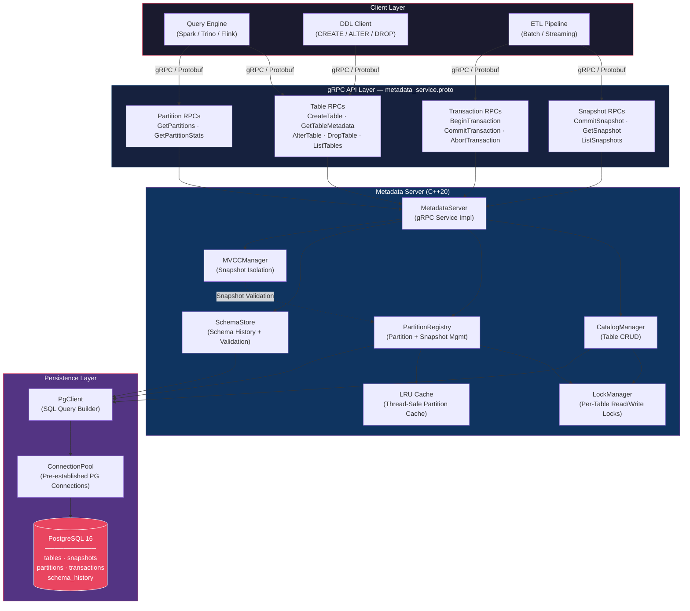
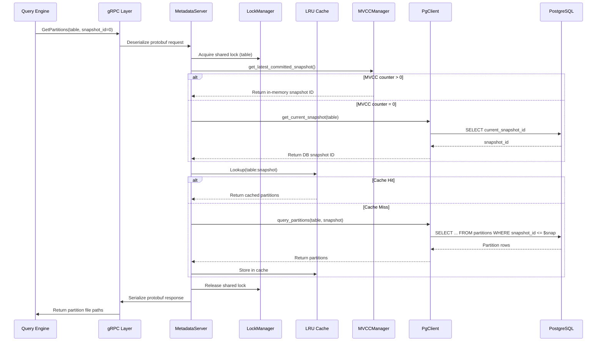
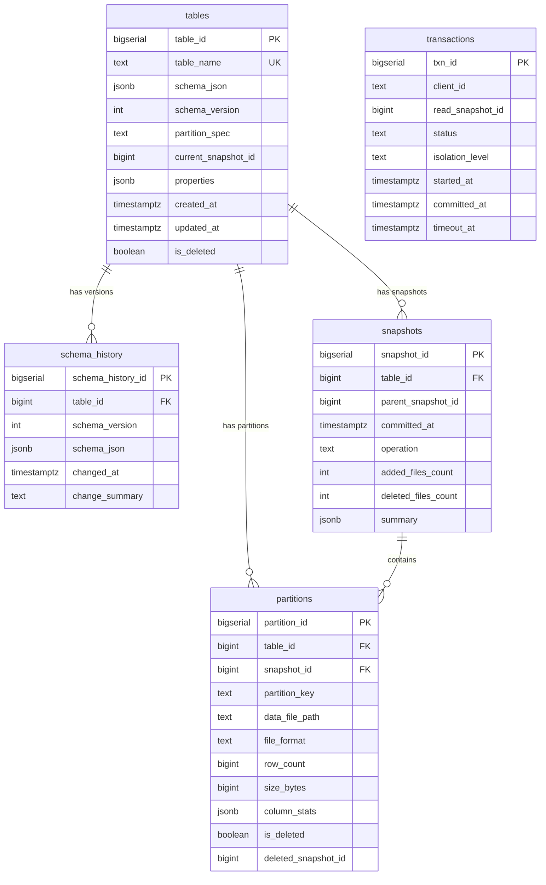

# IceLog — Distributed Metadata Catalog Service

A high-concurrency metadata control plane built in **C++20** that manages table catalogs, partition metadata, and snapshot versioning for open table formats (Apache Iceberg) storing columnar data (Parquet).

---

## Overview

IceLog sits between compute nodes and storage in a distributed data platform. When a query engine (Spark, Trino, Flink) needs to resolve `SELECT * FROM events WHERE month='Jan'`, IceLog tells it exactly which Parquet files to read — from which snapshot — without scanning the entire storage layer.

### What IceLog Tracks

- **Table Schemas** — Full version history with schema evolution (add/rename/drop columns)
- **Partition Metadata** — 1M+ active data partitions with S3 file paths, row counts, byte sizes, column statistics
- **Snapshot History** — Immutable, append-only snapshot chain for MVCC-based consistent reads and time-travel queries
- **Transaction State** — Distributed transaction coordination with Snapshot Isolation guarantees

### Key Use Cases

- **Data Lakes & Lakehouses**: Managing massive columnar datasets stored on S3, GCS, or Azure Blob Storage.
- **High-Concurrency Analytics**: Serving metadata required for querying by dozens of concurrent Spark and Trino clusters.
- **Streaming Ingestion**: Acting as the state backend to continuously append new micro-batches of data exactly once.
- **Machine Learning Pipelines**: Providing point-in-time snapshots for reproducible model training.

### Core Features

- **Blazing Fast Lookups**: Dual-layer caching strategy and pre-established connection pools guarantee minimal overhead during query planning.
- **Strong Consistency**: ACID compliance over table changes with optimistic concurrency mechanisms.
- **Language Agnostic**: Built on gRPC, enabling clients in Python, Java, Go, Rust, and more.
- **Schema Evolution Compatibility**: Supports safe schema modifications without downtime or rewriting data.

---

## Architecture



### Request Flow



---

## gRPC API Reference

IceLog exposes **13 RPCs** across 4 domains via `metadata_service.proto`:

### Table Management

| RPC | Description | Key Fields |
|-----|-------------|------------|
| `CreateTable` | Register a new table with schema, partition spec, and properties | `table_name`, `schema_json`, `partition_spec`, `properties` |
| `GetTableMetadata` | Retrieve full table metadata including current partitions | `table_name`, `snapshot_id` (0 = latest) |
| `AlterTable` | Evolve schema (add columns) or rename table | `table_name`, `new_schema_json` or `rename.new_name` |
| `DropTable` | Soft-delete or permanently purge a table and all related data | `table_name`, `purge` (true = hard delete) |
| `ListTables` | Paginated listing of active tables | `namespace`, `page_size`, `page_token` |

### Snapshot Management

| RPC | Description | Key Fields |
|-----|-------------|------------|
| `CommitSnapshot` | Atomically commit new/deleted partitions as an immutable snapshot | `table_name`, `parent_snapshot_id`, `operation`, `new_partitions`, `deleted_partition_keys` |
| `GetSnapshot` | Retrieve metadata for a specific snapshot | `table_name`, `snapshot_id` |
| `ListSnapshots` | List snapshot history for a table (newest first) | `table_name`, `limit` |

### Partition Management

| RPC | Description | Key Fields |
|-----|-------------|------------|
| `GetPartitions` | Retrieve visible partitions at a given snapshot (supports time-travel) | `table_name`, `snapshot_id`, `page_size`, `page_token` |
| `GetPartitionStats` | Aggregated stats: total partitions, rows, bytes, avg size | `table_name` |

### Transaction Management

| RPC | Description | Key Fields |
|-----|-------------|------------|
| `BeginTransaction` | Start a new transaction with a read snapshot | `client_id`, `isolation` (SNAPSHOT / READ_COMMITTED) |
| `CommitTransaction` | Commit a transaction (fails if expired) | `txn_id` |
| `AbortTransaction` | Abort and roll back a transaction | `txn_id` |

---

## Database Schema



### Indexes

| Index | Table | Columns | Filter |
|-------|-------|---------|--------|
| `idx_snapshots_table_time` | snapshots | `(table_id, committed_at DESC)` | — |
| `idx_partitions_table_snapshot` | partitions | `(table_id, snapshot_id)` | `WHERE is_deleted = false` |
| `idx_partitions_table_key` | partitions | `(table_id, partition_key)` | `WHERE is_deleted = false` |
| `idx_txn_active` | transactions | `(status)` | `WHERE status = 'active'` |

---

## Tech Stack

| Component | Technology | Purpose |
|-----------|------------|---------|
| Language | C++20 | High-performance, low-latency metadata operations |
| RPC Framework | gRPC + Protobuf | Binary serialization, HTTP/2 multiplexing, streaming |
| Persistence | PostgreSQL 16 | ACID transactions, JSONB for flexible schemas, partial indexes |
| Build System | CMake 3.20+ | Cross-platform builds, dependency management |
| Testing | Google Test | Unit and integration tests |
| Benchmarking | Google Benchmark | Microbenchmarks for cache, lock, and query paths |
| Containerization | Docker Compose | Single-command local development setup |

---

## Project Structure

```
IceLog/
├── proto/
│   └── metadata_service.proto     # gRPC service definition (13 RPCs)
├── src/
│   ├── main.cpp                   # Server entry point, signal handling
│   ├── server/
│   │   ├── metadata_server.h      # gRPC service implementation (header)
│   │   └── metadata_server.cpp    # RPC handlers → manager delegation
│   ├── catalog/
│   │   ├── catalog_manager.h/cpp  # Table CRUD with locking
│   │   ├── partition_registry.h/cpp # Partition + snapshot management with cache
│   │   └── schema_store.h/cpp     # Schema versioning and validation
│   ├── transaction/
│   │   ├── mvcc_manager.h/cpp     # In-memory MVCC: snapshot isolation, txn lifecycle
│   │   └── snapshot.h/cpp         # Snapshot struct and chain builder
│   ├── db/
│   │   ├── pg_client.h/cpp        # PostgreSQL query layer (all SQL lives here)
│   │   └── connection_pool.h/cpp  # Thread-safe PG connection pool with validation
│   ├── lock/
│   │   └── lock_manager.h/cpp     # Per-table shared/exclusive locks (std::shared_mutex)
│   ├── cache/
│   │   └── lru_cache.h            # Generic thread-safe LRU cache (header-only)
│   └── config/
│       └── server_config.h        # Environment-based configuration
├── scripts/
│   └── init_db.sql                # Database schema initialization
├── tests/                         # Google Test suites
├── benchmarks/                    # Google Benchmark suites
├── docker-compose.yml             # PostgreSQL + server containers
└── CMakeLists.txt                 # Build configuration
```

---

## Getting Started

### Prerequisites

- **C++20 compiler** (GCC 12+, Clang 15+, Apple Clang 15+)
- **CMake 3.20+**
- **gRPC** and **Protobuf** (via Homebrew, apt, or vcpkg)
- **PostgreSQL 16** (via Docker or local install)
- **grpcurl** (for testing)

### Option 1: Docker Compose (Recommended)

```bash
# Start PostgreSQL and initialize schema
docker-compose up -d postgres

# Build
mkdir build && cd build
cmake .. -DCMAKE_BUILD_TYPE=Release
make -j$(nproc)

# Run
./metadata_server
```

### Option 2: Local PostgreSQL (macOS / Homebrew)

```bash
# Install dependencies
brew install cmake grpc protobuf postgresql@16 grpcurl

# Start PostgreSQL
brew services start postgresql@16

# Create database and user
createdb metadata
psql metadata -c "CREATE USER metadata_user WITH PASSWORD 'metadata_pass';"
psql metadata -c "GRANT ALL PRIVILEGES ON DATABASE metadata TO metadata_user;"
psql -U metadata_user metadata < scripts/init_db.sql

# Build
mkdir build && cd build
cmake .. -DCMAKE_BUILD_TYPE=Release -DCMAKE_PREFIX_PATH="/opt/homebrew"
make -j$(sysctl -n hw.ncpu)

# Run
export PG_CONN_STRING="host=localhost port=5432 dbname=metadata user=metadata_user password=metadata_pass"
export GRPC_PORT="50051"
./metadata_server
```

### Environment Variables

| Variable | Default | Description |
|----------|---------|-------------|
| `PG_CONN_STRING` | — | PostgreSQL connection string |
| `GRPC_PORT` | `50051` | gRPC listen port |
| `POOL_SIZE` | `10` | Connection pool size |
| `CACHE_CAPACITY` | `10000` | LRU cache max entries |

---

## Testing with grpcurl

```bash
# List available RPCs
grpcurl -plaintext -import-path proto -proto metadata_service.proto \
  localhost:50051 describe metadata.MetadataService

# Create a table
grpcurl -plaintext -import-path proto -proto metadata_service.proto \
  -d '{"table_name":"events","schema_json":"{\"fields\":[{\"name\":\"event_id\",\"type\":\"long\"},{\"name\":\"ts\",\"type\":\"timestamp\"}]}","partition_spec":"month","properties":{"owner":"data-eng"}}' \
  localhost:50051 metadata.MetadataService/CreateTable

# Commit a snapshot with partitions
grpcurl -plaintext -import-path proto -proto metadata_service.proto \
  -d '{"table_name":"events","parent_snapshot_id":0,"operation":"append","new_partitions":[{"partition_key":"month=2025-01","data_file_path":"s3://bucket/events/month=2025-01/part-0.parquet","row_count":100000,"size_bytes":15000000,"file_format":"parquet"}]}' \
  localhost:50051 metadata.MetadataService/CommitSnapshot

# Get table metadata with partitions
grpcurl -plaintext -import-path proto -proto metadata_service.proto \
  -d '{"table_name":"events"}' \
  localhost:50051 metadata.MetadataService/GetTableMetadata

# Time-travel: read partitions from a specific snapshot
grpcurl -plaintext -import-path proto -proto metadata_service.proto \
  -d '{"table_name":"events","snapshot_id":1}' \
  localhost:50051 metadata.MetadataService/GetPartitions

# Begin and commit a transaction
grpcurl -plaintext -import-path proto -proto metadata_service.proto \
  -d '{"client_id":"spark-driver-1","isolation":"SNAPSHOT"}' \
  localhost:50051 metadata.MetadataService/BeginTransaction

grpcurl -plaintext -import-path proto -proto metadata_service.proto \
  -d '{"txn_id":1}' \
  localhost:50051 metadata.MetadataService/CommitTransaction
```

---

## Key Design Decisions

### Snapshot Isolation via MVCC
Every data mutation creates a new **immutable snapshot**. Readers always see a consistent view of the world at a specific snapshot ID. This enables:
- **Time-travel queries** — read data as of any historical snapshot
- **Conflict detection** — writers validate their parent snapshot is still current before committing
- **No read locks** — readers never block writers

### Per-Table Locking
The `LockManager` provides **shared/exclusive locks per table name** using `std::shared_mutex`. Reads acquire shared locks (concurrent), mutations acquire exclusive locks (serialized per table, parallel across tables).

### Two-Tier Caching
Partition queries hit an **in-memory LRU cache** first (keyed by `table:snapshot_id`). Cache misses fall through to PostgreSQL with partial indexes for fast lookups. Cache is invalidated on every `CommitSnapshot`.

### Connection Pooling
A thread-safe connection pool pre-establishes PostgreSQL connections at startup. Connections are validated before use and auto-reset on failure. This eliminates per-request connection overhead.

---

## Performance

| Path | Latency | Mechanism |
|------|---------|-----------|
| L1: Cache hit | ~1–10 μs | In-process LRU hash lookup |
| L2: DB query | ~2–5 ms | Partial index on live partitions |
| L3: Pool overhead | ~0 ms | Pre-established PG connections |
| Protobuf serde | ~0.1–0.5 ms | Binary format, zero-copy where possible |

**Target:** sub-10ms metadata retrieval for 1M+ active partitions at p99.
